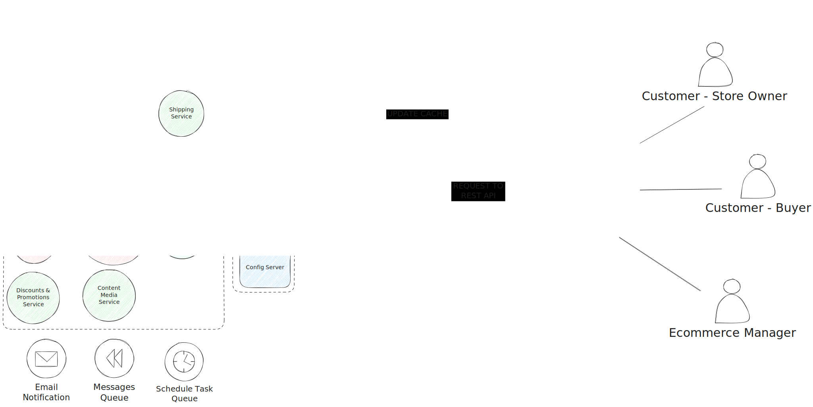

# ECommerce

La idea es hacer un ECommerce que tenga una SPA como Frontend y un Backend de micro-servicios con API REST. Usar SQL y NoSQL para la base de datos según el uso que sea necesario.

## FrontEnd

App (Sin empezar): [Git Repo](https://github.com/Joacohbc/ecommerce-frontend)

Landing (Sin empezar): [Git Repo](https://github.com/Joacohbc/ecommerce-landing)

**Tecnologías**:

- React / Redux / React Router
- Astro
- Tailwind / Algún Framework de Componentes de React

La idea es tener una SPA e Interactiva, que este divida en servicios y componentes de migrar una posible PWA o Aplicación Mobile y que tenga un buen SEO. Debería tener una linda Landing Page y un buen Dashboard para el usuario.

## Mobile App (Not Git Repo yet!)

- Kotlin / Android Studio

Una App que sea nativa, que tenga las mismas funcionalidades que la SPA y que pueda ser usada en dispositivos móviles.

## Backend

Backend (Work in progress): [Git Repo](https://github.com/Joacohbc/ecommerce-microservices)

**Tecnologías**:

- Java / Spring Boot / Eureka
- Node.js / Express.js / Nest.js
- Golang / Echo / Fiber
- Python / Data Analysis

Un Backend que no sea monolítico, que sea parte de una arquitectura de micro-servicios y que tenga una API REST. Debería tener un sistema de autenticación y autorización con JWT, un sistema de logs y un sistema de monitoreo. Debería tener un sistema de cache y un sistema de colas para las tareas que no sean inmediatas (asíncrona).

- Envió de Emails / Notificaciones
- Generación de Reportes
- Procesamiento de Pagos
- Configuración de Tareas Asíncronas
- Sistema de Imports de CSV
- Sistema de Logs
- Sistema de Monitoreo
- Sistema de Cache
- Sistema de Colas (con RabbitMQ, para manejar Orders por ejemplo)
- Sistema de Autenticación y Autorización
- Sistema de Seguridad
- Sistema de Backup y Restore
- Sistema de Internacionalización (multi-idioma)
- Sistema de Pruebas Unitarias y de Integración
- Documentación de la API

## Base de Datos

- MongoDB
- Redis
- MySQL

Las Base de datos NoSQL para las partes que no sea necesario tener una relación, no forme parte de la integridad de los datos o pueda generar una cantidad masiva de Datos (por ejemplo, el carrito). MySQL para las partes que si sea necesario tener una relación y la integridad de los datos.
